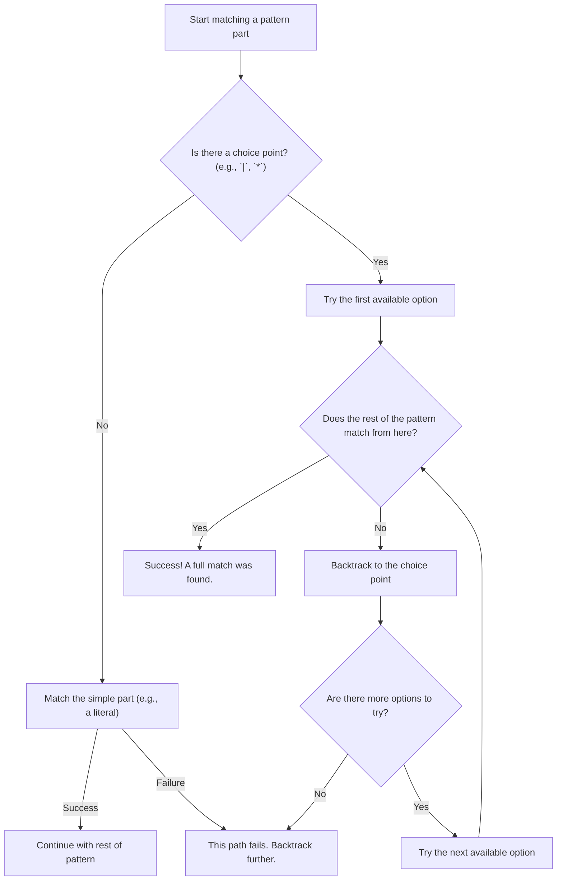

# CooleRE - backtracking.

<html> 
	  
</html> 

A regular expressions engine written in Python.
This variant is built using the backtracking algorithm.
The algorithm is also called Recursive Descent Parser.

A sort of straight forward approach:
1. Lexer breaks string into Tokens
1. Build a tree structure with operations as nodes and operands as leaves.
  1. Operands could be operations themselves, so this is recursive
1. Evaluate the tree 

Yeah. I know.
  

### The Backtracking Approach

* **The Gist:** It's basically just trial and error!
* **Making Choices:** Whenever the engine hits a part of the pattern with options (like `|` or `*`), it has to make a choice.
* **Go for It:** It just grabs the first option it sees and runs with it.
* **Whoops, Go Back!:** If that path doesn't work out, no big deal! The engine just "backtracks" to where it made its last choice and tries the next option on the list.
* **Success!:** If a path works all the way to the end, then we've found a match!
* **Giving Up:** If the engine tries every single option from every choice point and nothing works, then it's time to call it quits—the pattern doesn't match.

---
### Connecting to Our Regex Engine

So, how does our code pull this off? It's all thanks to Python's generators (`yield`)! They make it super clean.

* The **choice points** in our code are just the `RegexNode` classes. Their `match` methods can `yield` more than one result.
    * Take a look at the `Star` and `Question` classes. When they say `yield pos`, that's them offering the "hey, let's match nothing" option. Then, their loops go on to `yield` other possibilities.
    * And for the `Alternation` class, it first tries the left side with `yield from self.left.match(...)`. If that doesn't lead to a final match, the engine naturally backtracks and eventually gets around to trying the right side with `yield from self.right.match(...)`.
* The real magic of the **backtracking loop** is in the `Sequence._match_sequence` method.
    * That `for new_pos in ...` line? That's the engine **trying an option**. It's grabbing a possible match that a node's generator offered up.
    * Then, the `yield from self._match_sequence(...)` call is the engine trying to move ahead with that choice.
    * If things don't work out down the line, that recursive call just ends. The `for` loop just moves on to the next iteration, which automatically asks the generator for the *next* option. That's the backtracking step right there—it's automatic! We don't need any complicated code to keep track of things because the generators do it all for us.

# References:
* [Backtracking on Wikipedia](https://en.wikipedia.org/wiki/Backtracking)
* [A general page on Parsers on Wikipedia](https://en.wikipedia.org/wiki/Parsing#Types_of_parsers)

