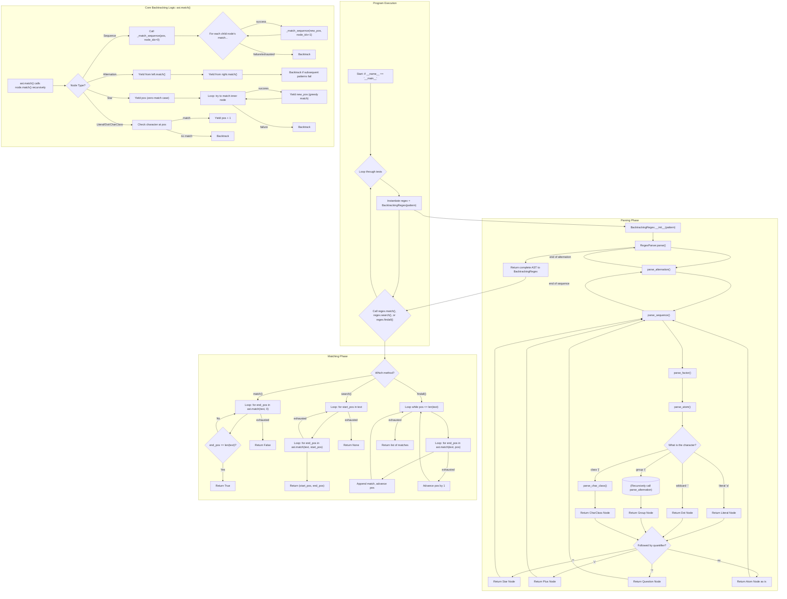

### 1. Program Execution (Top-Level Flow)

This is the entry point when the script is run.
* Start at the `if __name__ == '__main__'` block.
* Iterate through a list of predefined test cases.
* For each test case, create an instance of the `BacktrackingRegex` class. This single action kicks off the entire **Parsing Phase**.
* Call one of the matching methods (`.match()`, `.search()`, or `.findall()`) on the instance, which begins the **Matching Phase**.

---

### 2. Parsing Phase (Building the Abstract Syntax Tree)

This phase happens inside the `BacktrackingRegex.__init__` method. Its goal is to convert the raw regex string (e.g., `"(a|b)*c"`) into a tree of `RegexNode` objects (an AST) that the engine can execute.

* The flow starts with `RegexParser.parse()`, which calls `parse_alternation()`.
* The parser uses a method hierarchy that respects regex operator precedence, a technique called "recursive descent":
    1.  `parse_alternation()` looks for `|`. It calls `parse_sequence()` to get the content on either side.
    2.  `parse_sequence()` handles concatenated items (like `abc`). It repeatedly calls `parse_factor()` to get each item in the sequence.
    3.  `parse_factor()` handles quantifiers (`*`, `+`, `?`). It calls `parse_atom()` to get the base item and then wraps it in a `Star`, `Plus`, or `Question` node if a quantifier is present.
    4.  `parse_atom()` is the final step, identifying the most basic parts: a `Literal` character, a `.` `Dot` node, a `[...]` `CharClass` node, or a `(...)` group. If it finds a group, it recursively calls `parse_alternation()` to build the sub-tree for the group's contents.
* This process continues until the entire pattern string is consumed. The final, complete AST is returned and stored in the `BacktrackingRegex` instance.

---

### 3. Matching Phase (Executing the AST)

This phase begins when `match()`, `search()`, or `findall()` is called. These methods are wrappers around the core matching logic.

* **`match()`**: Tries to match the AST starting only at position `0` of the text. It succeeds only if one of the possible matches consumes the *entire* string (i.e., `end_pos == len(text)`).
* **`search()`**: This method is more flexible. It loops through every possible starting position in the text (`for start_pos in text...`) and tries to match the AST from there. It returns immediately with the first successful match it finds.
* **`findall()`**: This method also loops from every position. When it finds a match, it records it and then importantly, advances its starting position to the end of that match to find the next *non-overlapping* one. It continues until the end of the string is reached and returns the complete list of all matches found.

---

### 4. Core Backtracking Logic (The `node.match()` Generators)

This is the heart of the engine, highlighted in the diagram. It's not one method, but the collective behavior of the `match()` methods on every node in the AST. The use of generators (`yield`) is key.

* When a node's `match()` method is called, it `yields` every possible way it can match.
* **Sequence Node**: It tries to match its child nodes one by one. If `child_2` fails, the engine "backtracks". The `Sequence` node's loop then asks `child_1`'s generator for its *next* possible match. If `child_1` can match in a different way (e.g., if it was a `Star` node), the sequence tries again from that new state. If not, the `Sequence` itself fails.
* **Alternation Node**: It first `yields` all possible matches from its left child. If the rest of the regex pattern fails with all of those options, the engine backtracks to the `Alternation` node, which then starts yielding all possible matches from its right child.
* **Star Node (`*`)**: It first `yields` the current position (the "zero-match" case). If that path fails, the engine backtracks, and the `Star` node then tries to match its inner content once, yields that new position, and so on. It offers up every possibility, from zero matches to the maximum possible number of greedy matches.
* **Literal/Dot/CharClass**: These are the simplest. They check the character at the current position. If it matches, they `yield pos + 1`. If not, they yield nothing, causing an immediate backtrack in the node that called them.